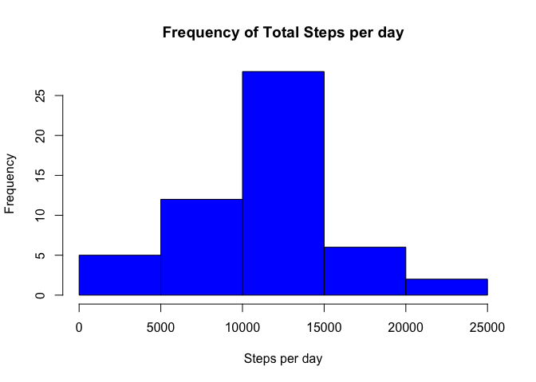
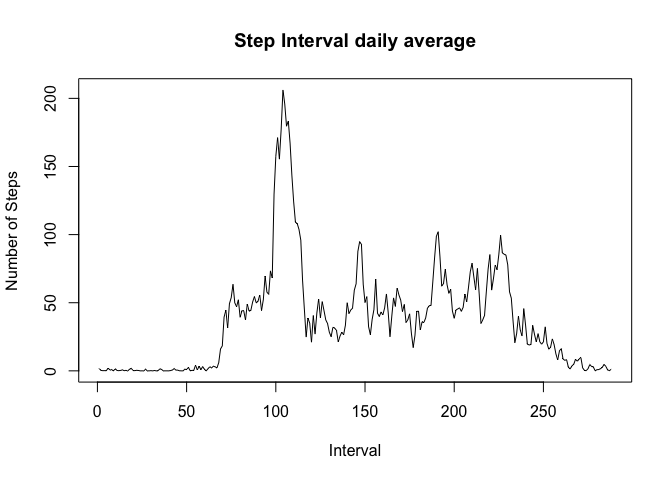
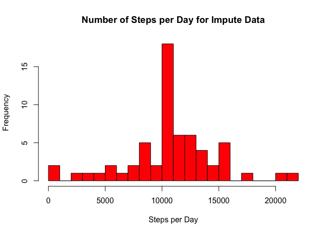
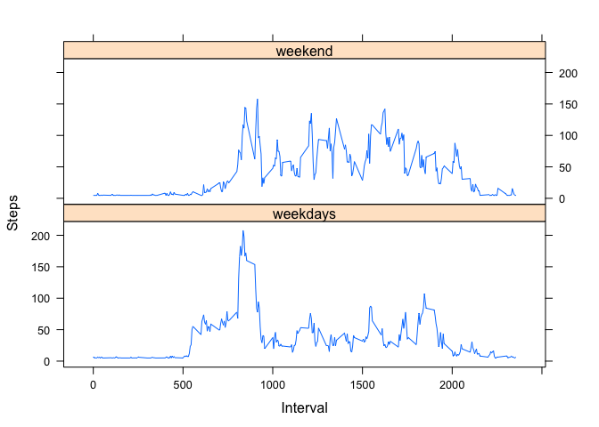

# Reproducible Research Peer Assignment 1
Damien Edwards  
February 2, 2015  

This is an assignment that uses data from a personal activity monitoring device. The device collects data at 5 minute intervals through the day. The data consists of two months of data from an anonymous individual collected during the months of October and November,2012 and include the number of steps taken in 5 minute intervals each day.

The variables included in this dataset are:

1.steps: Number of steps taking in a 5-minute interval (missing values are coded as NA)

2.date: The date on which the measurement was taken in YYYY-MM-DD format

3.interval: Identifier for the 5-minute interval in which measurement was taken

The dataset is stored in a comma-separated-value (CSV) file and there are a total of 17,568 observations in this dataset.

### Loading and preprocessing the data

The data is downloaded from the Course Website:

https://class.coursera.org/repdata-011/human_grading/view/courses/973512/assessments/3/submissions

The data is in zip file:

repdata-data-activity.zip


Below the data is read and the column names are shown.

```r
activity <- read.csv("activity.csv")
head(activity,3)
```

```
##   steps       date interval
## 1    NA 2012-10-01        0
## 2    NA 2012-10-01        5
## 3    NA 2012-10-01       10
```

```r
summary(activity)
```

```
##      steps                date          interval     
##  Min.   :  0.00   2012-10-01:  288   Min.   :   0.0  
##  1st Qu.:  0.00   2012-10-02:  288   1st Qu.: 588.8  
##  Median :  0.00   2012-10-03:  288   Median :1177.5  
##  Mean   : 37.38   2012-10-04:  288   Mean   :1177.5  
##  3rd Qu.: 12.00   2012-10-05:  288   3rd Qu.:1766.2  
##  Max.   :806.00   2012-10-06:  288   Max.   :2355.0  
##  NA's   :2304     (Other)   :15840
```
Data for the date will be transformed later in the report.

###What is mean total number of steps taken per day?

Total Number of steps taken per day.

```r
ag_activity<-aggregate(steps ~ date, activity, sum)$steps
hist(ag_activity, breaks = 6, col = "blue", main = "Frequency of Total Steps per day", xlab = "Steps per day")
```

 

The mean:

```r
mean_steps<-mean(ag_activity,na.rm = T)
mean_steps
```

```
## [1] 10766.19
```

The median:

```r
median_steps<-median(ag_activity,na.rm = T)
median_steps
```

```
## [1] 10765
```

###What is the average daily activity pattern?
Time series Plot:


```r
ag2_activity<-aggregate(steps ~ interval, activity, mean)
plot(ag2_activity$steps, type="l", main="Step Interval daily average", ylab="Number of Steps",xlab="Interval")
```

 
The 5 month interval with the largest number of steps is :


```r
interval_max<- which.max(ag2_activity$steps)
interval_max
```

```
## [1] 104
```
###Inputing missing values
The total number of missing rows is 2304

```r
sum(as.numeric(is.na(activity$steps)))
```

```
## [1] 2304
```

Devise a strategy for filling in all of the missing values of the dataset:

(I will use the average value to replace the NAs in the dataset.)

```r
mean(activity$steps, na.rm=T)
```

```
## [1] 37.3826
```

```r
impute_activity <- activity
impute_activity$steps[is.na(impute_activity$steps)] <- mean(impute_activity$steps, na.rm = T)
colSums(is.na(impute_activity))
```

```
##    steps     date interval 
##        0        0        0
```
Make a histogram of the total number of steps taken each day and Calculate and report the mean and median total number of steps taken per day. Do these values differ from the estimates from the first part of the assignment? What is the impact of imputing missing data on the estimates of the total daily number of steps?

```r
library(reshape2)
impute_steps<- tapply(impute_activity$steps, impute_activity$date, sum)
impute_melt<- melt(impute_steps)
names(impute_melt) <- c("Date", "Steps")
head(impute_melt)
```

```
##         Date    Steps
## 1 2012-10-01 10766.19
## 2 2012-10-02   126.00
## 3 2012-10-03 11352.00
## 4 2012-10-04 12116.00
## 5 2012-10-05 13294.00
## 6 2012-10-06 15420.00
```

```r
hist(impute_melt$Steps,breaks=30,col="red", main="Number of Steps per Day for Impute Data",xlab="Steps per Day")
```

 
Mean:

```r
mean(impute_melt$Steps, na.rm = T)
```

```
## [1] 10766.19
```
Median

```r
median(impute_melt$Steps, na.rm = T)
```

```
## [1] 10766.19
```
The mean and the median are the same as before. Adding the average for the NA values results in similar mean and median.

##Are there differences in activity patterns between weekdays and weekends?

Create a new factor varialbe with two levels – “weekday” and “weekend” indicating whether a given date is a weekday or weekend day:

```r
library(plyr)
impute_activity$weekdays<-weekdays(as.Date(impute_activity$date))
impute_activity$weeks[(impute_activity$weekdays == "Saturday" | impute_activity$weekdays == "Sunday")] <- "weekend"
impute_activity$weeks[!(impute_activity$weekdays == "Saturday" | impute_activity$weekdays == "Sunday")] <- "weekdays"
full_week <- ddply(impute_activity, c("interval", "weeks"), function(x) apply(x[1], 
    2, mean))
head(full_week)
```

```
##   interval    weeks    steps
## 1        0 weekdays 7.006569
## 2        0  weekend 4.672825
## 3        5 weekdays 5.384347
## 4        5  weekend 4.672825
## 5       10 weekdays 5.139902
## 6       10  weekend 4.672825
```
The plot below shows the difference between the number of steps on the weekend and weekdays:


```r
library(lattice)
xyplot(steps~interval|weeks,data=full_week,xlab="Interval", ylab="Steps",type="l",layout=c(1,2))
```

 


